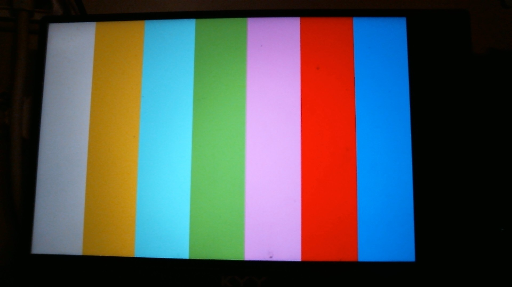
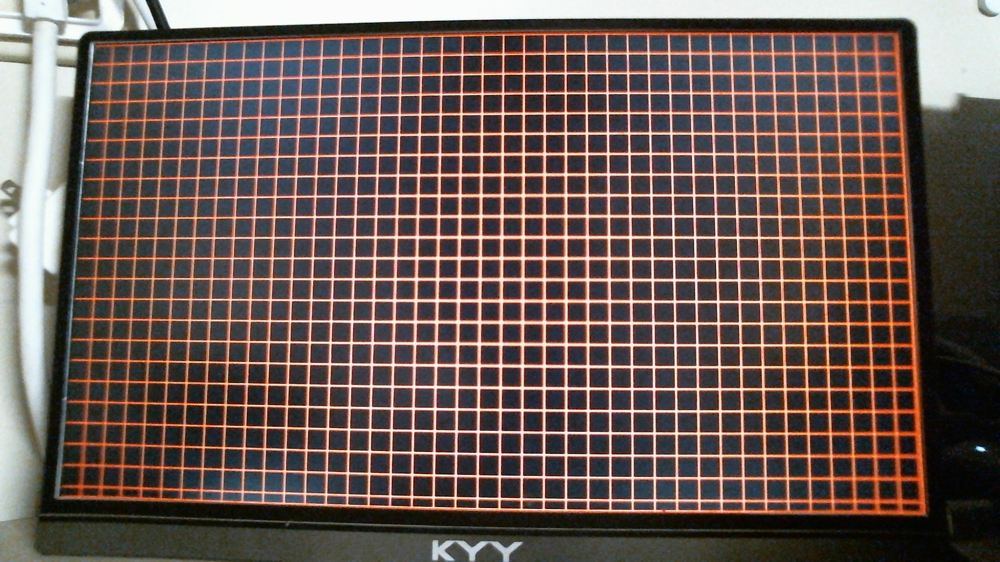
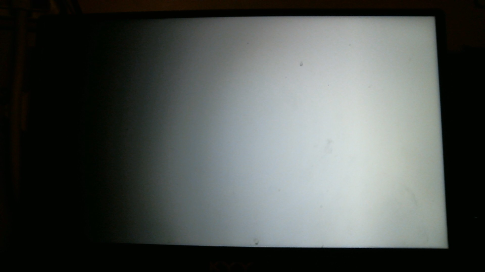
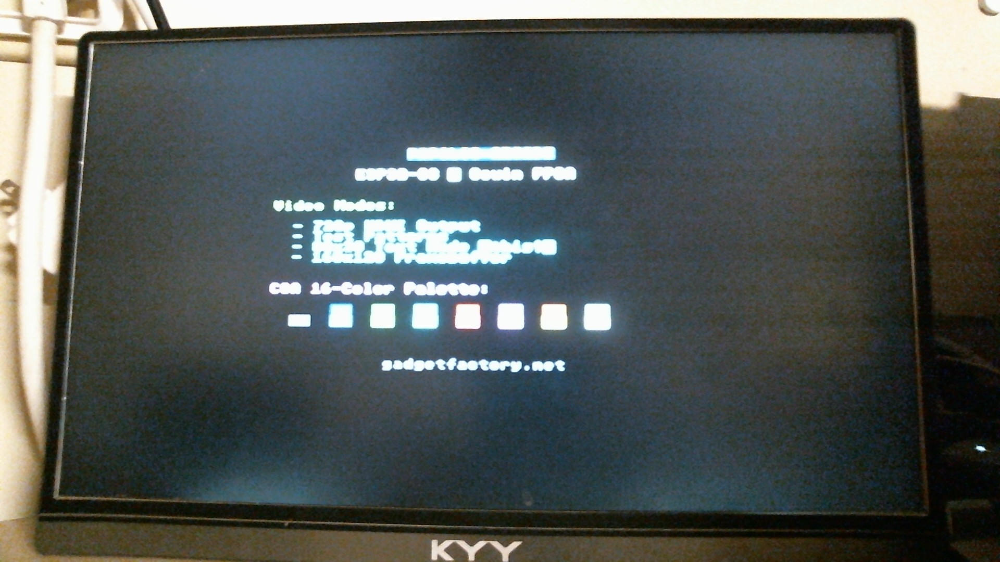
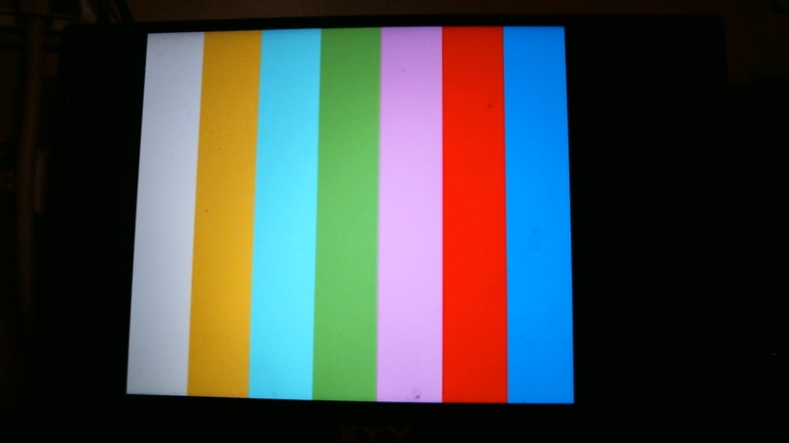

# Papilio Arcade HDMI Video System - Test Results

This document shows the verified video modes available in the modular HDMI video architecture.

**Test Date:** November 30, 2025  
**Platform:** Papilio Arcade (ESP32-S3 + Gowin GW2A-18C FPGA)  
**Resolution:** 720p @ 60Hz (1280x720 active area)

---

## Video Mode Architecture

The video system uses a modular architecture with three independent video generators selected via Wishbone register at address `0x0000`:

| Mode | Register Value | Description |
|------|----------------|-------------|
| 0 | `0x00` | Test Pattern Generator (with sub-patterns) |
| 1 | `0x01` | Text Mode (80x30 characters, 8x24 font) |
| 2 | `0x02` | Framebuffer Mode (160x120 RGB332, 6x scaled) |

---

## Mode 0: Test Patterns

The test pattern generator has three sub-patterns controlled via register `0x0010`:

### Pattern 0: Color Bars

8 equal-width vertical bars (160 pixels each) spanning the full 1280 pixel width.

Colors (left to right): White, Yellow, Cyan, Green, Magenta, Red, Blue, Black



### Pattern 1: Grid Pattern

Orange grid lines every 32 pixels on a black background. Useful for verifying pixel alignment and timing.



### Pattern 2: Grayscale Gradient

Smooth horizontal gradient from black (left edge) to white (right edge).



---

## Mode 1: Text Mode

80 columns × 30 rows text display with CGA-style 16-color attributes.

- Character cell: 16×24 pixels (8×8 font scaled 2×3)
- Display area: 1280×720 pixels
- Foreground/background colors per character



---

## Mode 2: Framebuffer Mode

160×120 pixel framebuffer with RGB332 color format, scaled 6× to fill 960×720 with 160-pixel black borders on each side.

- Resolution: 160×120 native, 960×720 displayed
- Color depth: 8-bit RGB332 (3-3-2 bits for R-G-B)
- Memory: 19,200 bytes framebuffer RAM
- Centering: 160px black borders left/right



---

## Register Map

| Address | Register | Description |
|---------|----------|-------------|
| `0x0000` | VIDEO_MODE | Video mode select (0=Test, 1=Text, 2=Framebuffer) |
| `0x0010` | TEST_PATTERN | Test pattern select (0=Bars, 1=Grid, 2=Gray) |
| `0x0020` | TEXT_CURSOR_X | Text cursor X position |
| `0x0021` | TEXT_CURSOR_Y | Text cursor Y position |
| `0x0022` | TEXT_CHAR | Character to write |
| `0x0023` | TEXT_ATTR | Character attribute (fg/bg color) |
| `0x0024` | TEXT_CTRL | Text control commands |
| `0x0100+` | FRAMEBUFFER | Framebuffer pixel data (19,200 bytes) |

---

## Usage via MCP Commands

```bash
# Set video mode
W 0000 00    # Test patterns
W 0000 01    # Text mode
W 0000 02    # Framebuffer mode

# Set test pattern (when in mode 0)
W 0010 00    # Color bars
W 0010 01    # Grid pattern
W 0010 02    # Grayscale gradient

# Write text (when in mode 1)
# Use MCP text tools: text_clear, text_write_at, text_set_color
```

---

## Test Summary

| Mode | Status | Notes |
|------|--------|-------|
| Test Pattern - Color Bars | ✅ PASS | Full width, correct colors |
| Test Pattern - Grid | ✅ PASS | 32px spacing, orange lines |
| Test Pattern - Grayscale | ✅ PASS | Smooth gradient |
| Text Mode | ✅ PASS | 80x30 chars, CGA colors |
| Framebuffer Mode | ✅ PASS | Full 160x120, 6x scaling, centered |

All video modes verified working correctly on 720p HDMI output.
